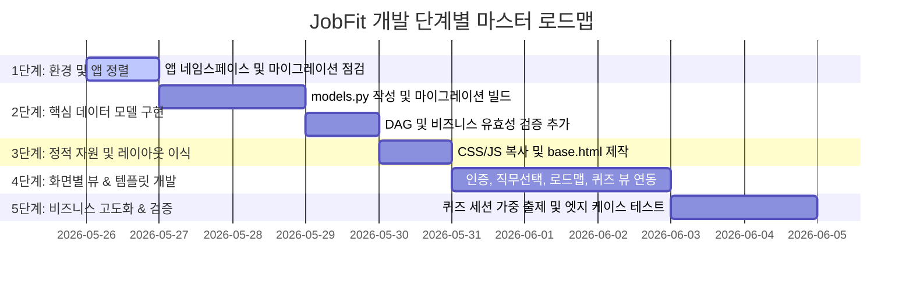

# JobFit Django 통합 풀스택 개발 구현 계획서

본 문서는 사용자가 구성한 `apps/` 폴더 기반의 평탄화된 디렉토리 구조를 반영하여, **JobFit** 풀스택 프로젝트를 단계적으로 완벽하게 빌드하기 위한 마스터 구현 계획서입니다.

---

## 1. 아키텍처 및 디렉토리 구조 정렬

사용자께서 `apps/` 디렉토리에 앱을 배치하고 `config/settings.py`에 로컬 앱을 등록해주신 구조는 프로젝트가 커질 때 매우 깔끔하고 우수한 구조입니다. 
다만, Django 앱 로더가 `apps/accounts`와 `apps/learning`을 정상적으로 가져오기 위해서는 개별 앱 내부 `apps.py`의 `name` 값을 설정 경로와 일치시켜주어야 합니다. 이 작업을 개발 시작의 최우선 단계로 진행합니다.

---

## 2. 개발 마일스톤 및 단계별 계획

개발은 안전하고 점진적인 탑다운(Top-down) 방식과 바텀업(Bottom-up) 방식을 조합하여 다음 **5개 단계**로 나누어 실행합니다.

### 📍 [1단계] Django 기본 환경 정렬 & 앱 네임스페이스 교정
*   **목표:** Django가 `apps/` 패키지를 정상 로드하도록 조정하고 데이터베이스 연결 상태를 검증합니다.
*   **주요 작업:**
    *   `apps/accounts/apps.py` 의 `name`을 `'apps.accounts'`로 수정
    *   `apps/learning/apps.py` 의 `name`을 `'apps.learning'`로 수정
    *   `python manage.py check` 명령을 통한 구동 무결성 확인 및 PostgreSQL 접속 테스트

### 📍 [2단계] 핵심 데이터 모델 구현 & DB 마이그레이션
*   **목표:** 기획 사양서(`decision_01`, `decision_03`)에서 설계된 13개 핵심 데이터 모델을 선언하고 DB 스키마를 동기화합니다.
*   **주요 작업:**
    *   `apps/accounts/models.py` 내 `UserProfile` 및 빌트인 User 원격 연동 설정
    *   `apps/learning/models.py` 내 `Job`, `Skill`, `Roadmap`, `Curriculum`, `UserCurriculumProgress`, `QuizQuestion`, `QuizChoice`, `QuizAttempt`, `UserResponse`, `UserBookmark`, `UserNote` 모델 상세 선언
    *   Roadmap 자기참조(self-referential)를 활용한 DAG 구조 선언 및 데이터 무결성을 보장하는 유효성 검증 로직 구현
    *   `makemigrations` 및 `migrate` 실행하여 물리적 PostgreSQL 테이블 빌드

### 📍 [3단계] 정적 에셋(Static) 및 공통 템플릿(Templates) 이식
*   **목표:** 기존 프로토타입의 프리미엄 스타일을 온전히 활용하기 위해 리소스를 Django 표준 경로로 이식합니다.
*   **주요 작업:**
    *   `obsidian/prototype/source/` 하위 CSS(`styles.css`), JS(`app.js`) 파일을 글로벌 `static/css/`, `static/js/` 폴더로 복사 및 경로 매핑
    *   모든 템플릿의 기초가 될 글로벌 `templates/base.html` 설계 (Tailwind 미사용, Vanilla CSS 테마 및 Lucide 아이콘, Vis.js CDN 연동)

### 📍 [4단계] 화면별 뷰(View) 및 URL 라우팅 순차 개발
*   **목표:** 기획에 기술된 9개 핵심 페이지를 Django 뷰와 연동하여 실제로 브라우저 상에서 동작하게 만듭니다.
*   **주요 작업:**
    *   `accounts/views.py`: 메인/소셜 로그인(Landing) 가상 로그인 세션 생성 및 로그아웃 처리
    *   `learning/views.py`: 
        *   **모드 및 관심 직무 선택 뷰**: DB 데이터 연동 검색/선택
        *   **기술 로드맵 뷰**: Vis.js(Vis-Network)를 활용하여 DB 로드맵 데이터 기반으로 SVG 동적 드로잉 및 중첩 노드 렌더링
        *   **기술 상세 및 학습자료 뷰**: 마크다운 자료 파싱 및 북마크, 메모 AJAX 비동기 저장 뷰 연동
        *   **퀴즈 플레이 & 학습 결과 뷰**: 세션을 활용한 안전한 퀴즈 상태 추적 및 제출 뷰

### 📍 [5단계] 비즈니스 로직 고도화 및 defensive 테스트 검증
*   **목표:** 기획 문서 및 테스트 케이스 문서(`decision_02`)에 명시된 방어적 예외 처리와 로직의 완성도를 높입니다.
*   **주요 작업:**
    *   **퀴즈 출제 고도화**: 난이도 가중(쉬움 2개 @15점, 중간 2개 @20점, 어려움 1개 @30점) 및 무작위 셔플 추출, `QuizChoice` 순서의 임의 셔플링 구현
    *   **퀴즈 패스 점수**: 70점 미만 낙제 로직 및 재응시 흐름 세밀화
    *   **방어적 테스트 케이스 구축**: 로드맵 사이클 감지 검증, 미완료 선행기술 학습자료 접근 방지 검증, 중복 제출 차단 토큰 검증, 다른 직무 임시 전환 시 기존 진도 보존 검증 등 단위 테스트 작성

---

## 3. 사용자 검토 및 동의 필요 사항

> [!IMPORTANT]
> 1. **앱 네임스페이스 변경**: 장고가 `apps.accounts`, `apps.learning`을 명확하게 탐색할 수 있도록 `apps.py` 내부의 `name` 값을 수정해야 합니다. 이에 동의하시나요?
> 2. **PostgreSQL 실행 상태**: `.env`에 정의된 로컬 PostgreSQL 컨테이너/서버가 포트 `5432`로 정상 작동 중인가요? 개발을 시작하면서 데이터베이스 마이그레이션을 바로 적용할 예정입니다.
> 3. **개발 돌입 승인**: 본 마스터 구현 계획서를 검토하시고, 최종 승인해 주시면 [1단계] 앱 네임스페이스 정리와 [2단계] 데이터 모델 작성에 즉시 돌입하겠습니다.

---

## 4. 검증 계획 (Verification Plan)

### 자동화된 테스트
*   `python manage.py check`: Django 설정 및 앱 구성 에러 조기 감지
*   `python manage.py makemigrations --check`: 마이그레이션 누락 점검
*   `python manage.py test`: 작성된 모든 테스트 케이스(사이클 감지, 퀴즈 출제 로직, 권한 차단 등)가 통과하는지 CLI 상에서 검증

### 수동 검증
*   로컬 서버(`python manage.py runserver`) 실행 후 웹 브라우저를 통해 각 페이지의 UI, Vis.js 로드맵 드로잉 및 퀴즈 정답 제출 프로세스를 직접 모니터링 및 검증합니다.
