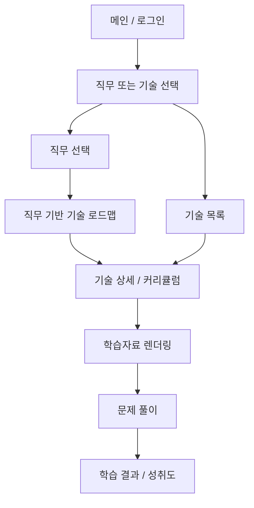

# JobFit 서비스 개요

## 1. 서비스 목적

JobFit은 사용자가 관심 있는 직무 또는 기술을 기준으로 학습을 시작할 수 있도록 돕는 직무·기술 기반 학습 로드맵 서비스이다.

사용자는 소셜 로그인을 통해 서비스에 진입한 뒤, 다음 두 가지 방식 중 하나를 선택한다.

- 직무 기반 탐색: 관심 직무를 선택하고, 해당 직무에 필요한 기술 로드맵을 확인한다.
- 기술 기반 탐색: 특정 기술을 직접 선택하고, 해당 기술의 상세 설명과 커리큘럼을 확인한다.

이후 사용자는 기술별 커리큘럼을 따라 학습자료를 확인하고, 문제 풀이를 통해 학습 성취도를 점검한다.

## 2. 핵심 사용자 흐름

## 3. 주요 기능

| 구분 | 기능 |
|---|---|
| 인증 | 소셜 로그인, 사용자 정보 저장 |
| 탐색 | 직무 기반 탐색, 기술 기반 탐색 |
| 추천 | 직무별 필요 기술 로드맵 제공 |
| 학습 | 기술 상세 설명, 단계별 커리큘럼 제공 |
| 콘텐츠 | 커리큘럼별 학습자료 렌더링 |
| 평가 | 객관식 문제 풀이, 답변 제출, 채점 |
| 기록 | 학습 완료 여부, 문제 풀이 결과, 성취도 저장 |

## 4. 화면 목록

| 번호 | 화면명 | 설명 |
|---|---|---|
| 01 | 메인 / 로그인 | 서비스 소개 및 소셜 로그인 |
| 02 | 직무 / 기술 선택 | 학습 시작 방식 선택 |
| 03 | 직무 선택 | 관심 직무 선택 |
| 04 | 직무 기반 기술 로드맵 | 선택 직무에 필요한 기술 구조 표시 |
| 05 | 기술 목록 | 기술 직접 탐색 및 필터링 |
| 06 | 기술 상세 / 커리큘럼 | 기술 설명 및 단계별 커리큘럼 |
| 07 | 학습자료 렌더링 | 선택 커리큘럼의 학습자료 표시 |
| 08 | 문제 풀이 | 학습 내용 기반 퀴즈 풀이 |
| 09 | 학습 결과 / 성취도 | 점수, 오답, 추천 학습 표시 |

## 5. 설계 메모

- 첫 화면은 서비스 제목, 서비스 소개, 소셜 로그인 영역으로 구성한다.
- 로그인 후 직무 또는 기술을 선택하는 분기 화면이 필요하다.
- 직무를 선택한 경우 직무 후보 목록을 보여주고, 선택 직무에 필요한 기술을 로드맵 형태로 제공한다.
- 기술을 선택한 경우 기술 목록과 필터링 사이드바를 제공한다.
- 기술 상세 페이지에서는 기술 설명과 커리큘럼 테이블을 함께 제공한다.
- 학습자료 페이지에서 문제 풀이 페이지로 이동할 수 있어야 한다.
- 문제 풀이 결과는 사용자 학습 이력으로 저장한다.
