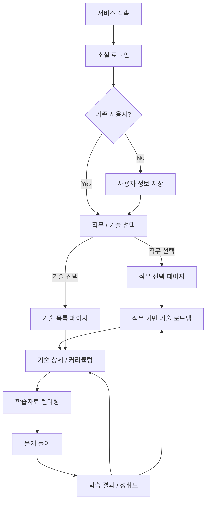

# 사용자 흐름

## 1. 전체 흐름

## 2. 직무 기반 학습 흐름

1. 사용자가 소셜 로그인한다.
2. 사용자가 `직무로 시작하기`를 선택한다.
3. 직무 목록에서 관심 직무를 선택한다.
4. 선택한 직무에 필요한 기술 로드맵을 확인한다.
5. 로드맵의 기술 노드를 클릭한다.
6. 기술 상세 설명과 커리큘럼을 확인한다.
7. 커리큘럼 Step을 선택해 학습자료를 본다.
8. 문제를 풀고 결과를 확인한다.

## 3. 기술 기반 학습 흐름

1. 사용자가 소셜 로그인한다.
2. 사용자가 `기술로 시작하기`를 선택한다.
3. 기술 목록에서 검색 또는 필터를 사용한다.
4. 학습할 기술을 선택한다.
5. 기술 상세 설명과 커리큘럼을 확인한다.
6. 커리큘럼 Step을 선택해 학습자료를 본다.
7. 문제를 풀고 결과를 확인한다.

## 4. 상태 저장이 필요한 사용자 행동

| 사용자 행동   | 저장 데이터                        |
| -------- | ----------------------------- |
| 로그인      | 사용자 ID, 이메일, 이름, 로그인 제공자      |
| 직무 선택    | 사용자 ID, 직무 ID                 |
| 기술 선택    | 사용자 ID, 기술 ID                 |
| 커리큘럼 선택  | 사용자 ID, 커리큘럼 ID               |
| 학습자료 열람  | 사용자 ID, 커리큘럼 ID, 열람 상태        |
| 문제 답변 제출 | 사용자 ID, 문제 ID, 선택지 ID, 정답 여부  |
| 학습 완료    | 사용자 ID, 기술 ID, 커리큘럼 ID, 완료 여부 |
