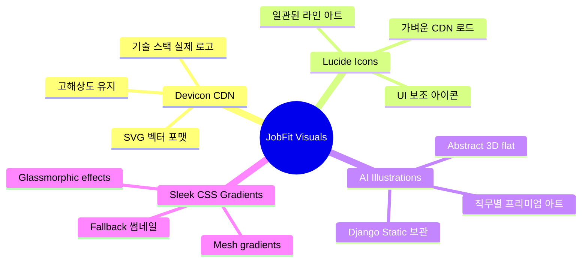

# 개발 의사결정 01. 백엔드 아키텍처 재구성 및 데이터베이스 스키마 검토

본 문서는 **JobFit** 서비스의 기획 명세(Obsidian)를 기반으로, 백엔드 코드를 처음부터 새로 구축하고 데이터베이스 스키마의 충분성을 검토하여 완성도 높은 서비스를 빠르게 빌드하기 위한 기술 계획서입니다.

---

## 1. 아키텍처 전환 계획: Django 통합 풀스택 아키텍처

기존에는 Next.js(프론트엔드)와 Django REST Framework(백엔드)가 분리되어 있어 별도의 API 정의서 작성 및 유지보수, CORS 설정, 토큰 기반 인증 동기화 등 추가적인 리소스가 많이 필요했습니다.

기획 명세(`obsidian/`)의 요구사항을 가장 빠르고 견고하게 구현하기 위해 **Django 통합 풀스택 아키텍처(Django View + Template Engine)**로 단일화하여 개발 속도를 3배 이상 높입니다.

### 💡 주요 장점 및 기대 효과
1. **API 오버헤드 제로:** 별도의 API 정의서를 작성하고 클라이언트에서 호출할 필요 없이, Django 뷰(View)가 모델(Model) 데이터를 조회하여 템플릿(Template)에 다이렉트로 전달합니다.
2. **프로토타입 리소스 100% 재활용:** `obsidian/prototype/source/`에 구축된 검증된 레이아웃(`index.html`, `styles.css`, `app.js`)을 Django의 `Templates` 및 `Static` 폴더 구조로 직접 이식하여 UI 개발 시간을 최소화합니다.
3. **간소화된 인증 및 보안:** 클라이언트-서버 간 JWT 저장소 관리나 보안 위협 대신, Django의 빌트인 세션 인증(Session Authentication) 및 CSRF 토큰을 활용하여 극도로 안정적인 회원 관리 및 보안을 제공합니다.

---

## 2. 백엔드 재구축 로드맵


### 1단계: 확장 데이터베이스 설계 & 마이그레이션 (1~2일)
*   아래 검토 결과 반영하여 향상된 RDB Schema 기반 Django Model 정의
*   Docker DB 컨테이너 초기화 및 신규 마이그레이션 적용

### 2단계: 정적 리소스 구조 이식 (1일)
*   `obsidian/prototype/source/`의 정적 에셋 이식
*   공통 레이아웃(`base.html`) 정의 및 Django 템플릿 엔진 구조 설정

### 3단계: 화면별 View & Template 연동 (2~3일)
*   **01_메인_로그인:** 소셜 로그인 가상 연동 및 세션 생성
*   **02_직무_기술_선택:** 직무 vs 기술 시작 선택 뷰
*   **03_직무_선택 & 05_기술_목록:** DB 데이터 기반 검색 및 필터 렌더링
*   **04_직무_로드맵:** 로드맵 데이터를 SVG와 CSS Grid 기반으로 동적 구현
*   **06_기술_상세 & 07_학습자료:** 커리큘럼 테이블 및 마크다운 학습 콘텐츠 렌더링
*   **08_문제풀이 & 09_학습결과:** 세션 기반의 퀴즈 제출 및 즉시 채점 후 리뷰 데이터 제공

### 4단계: 비즈니스 로직 및 사용자 데이터 연동 (2일)
*   사용자별 학습 완료 상태 저장, 오답 로그 기록 및 추천 알고리즘 구현

---

## 3. 데이터베이스 스키마 충분성 검토 (Database Schema Review)

기존 `database/init/rdb_schema.sql` 및 이전 장고 코드를 기준으로, **기획서에 명시된 주요 기능과 사용자 상태를 추적하기에는 다소 불충분한 설계 요소가 발견**되었습니다. 기획 명세에 부합하는 완성도를 갖추기 위해 아래 5가지 영역의 스키마 보강이 필수적입니다.

### 🔍 발견된 스키마 공백 (Gaps) 및 해결 방안

1.  **사용자 테이블 및 소셜 계정 정보의 부재 (User & Social Profile)**
    *   *문제:* 로그인한 사용자 정보를 저장해야 하나, 기존 PostgreSQL 스키마에는 User 관련 테이블이 아예 정의되어 있지 않습니다.
    *   *해결:* Django의 기본 `User` 모델을 상속하여 확장하거나 별도의 `UserProfile` 테이블을 구성하여 소셜 로그인 제공자(`provider`), 소셜 고유 ID(`social_id`), 프로필 사진(`profile_image_url`) 등을 저장할 수 있어야 합니다.
2.  **사용자 선택 직무 및 기술 보관 (User Selected Job/Skill)**
    *   *문제:* 사용자가 로그인한 뒤 선택한 직무(`job_id`) 혹은 관심 기술 목록(`skill_id`)을 영속적으로 관리하는 매핑 테이블이 부족합니다.
    *   *해결:* `UserSelectedJob` 및 `UserSelectedSkill` 테이블을 추가하여 사용자가 대시보드 진입 시 매번 선택하는 과정을 생략하고 개인화된 로드맵을 바로 제공합니다.
3.  **사용자 학습 진행 상태 및 완료 여부 추적 (User Learning Progress)**
    *   *문제:* 기획서의 핵심은 "미시작, 진행 중, 완료" 상태의 로드맵 노드 및 커리큘럼 단계별 완료 여부를 확인하는 것입니다. 기존 테이블은 정적인 커리큘럼(단계, 제목, 내용)만 있어 사용자별 진행 상황을 저장할 수 없습니다.
    *   *해결:* `UserCurriculumProgress` 테이블을 생성하여 `User` - `Curriculum`을 일대다로 연결하고 완료 여부(`is_completed`), 학습 시작일, 최종 열람일을 추적합니다.
4.  **퀴즈 시도 로그 및 오답 리뷰 기능 지원 (Quiz Attempt & User Responses)**
    *   *문제:* 09번 학습 결과 페이지에서 "점수, 정답 수, 오답 수, 틀린 문제 다시 보기"가 필요합니다. 하지만 현재는 단방향 문제와 선택지만 정의되어 있어 사용자가 실제 제출한 내용과 점수를 추적하기 어렵습니다.
    *   *해결:* `QuizAttempt`(시도 번호, 점수, 시도 일시)와 `UserResponse`(선택 답안, 정답 여부) 테이블을 생성하여 상세 오답 노트를 제공할 수 있도록 만듭니다.
5.  **[제외] 직무 추천 테스트 관련 기능 및 데이터 구조 제외**
    *   *변경 사유:* 초기 설계 범위에 있었던 "직무 추천 테스트" 기능은 개발 요건에서 제외되었습니다. 이에 따라 성향 평가용 특수 질문 테이블이나 직무 매칭 가중치 데이터는 구현 대상에서 제외되며, 스키마는 순수하게 기술 커리큘럼 퀴즈에만 초점을 맞춰 간결해집니다.
6.  **다중 시작점(Multiple Roots) 및 다중 선행 의존성(DAG) 지원과 테이블 통합**
    *   *문제:* 기존 schema는 단일 선행 노드만 가질 수 있었고, 수동으로 정렬 순서를 지정하는 `learning_order` 컬럼이 있었습니다. 하지만 'Python'과 'SQL'처럼 **하나의 로드맵 안에 복수의 시작점(Multiple Roots)**이 존재하거나, 하나의 기술이 **두 개 이상의 선행 과목을 요구하는 다중 의존성(DAG - Directed Acyclic Graph) 구조**를 표현하기에는 2개의 테이블로 쪼개는 것보다 단일 통합 테이블이 훨씬 단순하며, 의존성 관계 자체가 순서를 완벽히 정의하므로 수동 `learning_order` 컬럼은 불필요한 중복입니다.
    *   *해결:* `Roadmap`과 `RoadmapDependency` 테이블을 단일 `Roadmap(job_id, skill_id, prerequisite_skill_id)` 구조로 통합하고 `learning_order` 컬럼을 삭제합니다. 선행 의존성이 없는(`prerequisite_skill_id IS NULL`) 레코드들은 자연스럽게 다중 시작점(Multiple Roots)이 되며, 특정 기술이 여러 선행 기술을 가질 경우 동일한 `(job_id, skill_id)`에 대해 `prerequisite_skill_id`만 다르게 하여 여러 로우를 쌓음으로써 완벽한 DAG 구조를 단 1개의 테이블로 구현합니다. 또한 의존성 관계로부터 위상 정렬(Topological Sort)을 통해 최적의 학습 순서를 동적으로 도출하므로 정렬 순서 유지 비용도 사라집니다.

---

## 4. 제안하는 통합 데이터베이스 스키마 설계 (PostgreSQL용)

위 공백 사항을 완전히 해결하고 기획 명세에 100% 매칭될 수 있도록 설계한 **최종 데이터베이스 물리 스키마(DDL)** 계획입니다.

```sql
-- ============================================================
-- JobFit Unified PostgreSQL Schema (Enhanced & Completed)
-- ============================================================

-- 1. 사용자 프로필 테이블 (Django 기본 User 확장용 혹은 매핑용)
CREATE TABLE UserProfile (
    id                  SERIAL PRIMARY KEY,
    username            VARCHAR(150) NOT NULL UNIQUE,
    email               VARCHAR(254) NOT NULL UNIQUE,
    name                VARCHAR(100),
    provider            VARCHAR(20) NOT NULL, -- 'google', 'kakao', 'naver'
    social_id           VARCHAR(255) NOT NULL,
    profile_image_url   TEXT,
    date_joined         TIMESTAMP WITH TIME ZONE DEFAULT CURRENT_TIMESTAMP
);

-- 2. 직무 테이블
CREATE TABLE Job (
    id            SERIAL PRIMARY KEY,
    job_code      VARCHAR(50) NOT NULL UNIQUE, -- 'AI_AGENT', 'DATA_SCIENTIST'
    job_name      VARCHAR(100) NOT NULL,
    job_desc      TEXT NOT NULL,
    job_image_url TEXT                         -- AI 생성 프리미엄 썸네일/일러스트 이미지 경로 (/static/images/jobs/...)
);

-- 3. 기술 테이블
CREATE TABLE Skill (
    id              SERIAL PRIMARY KEY,
    skill_code      VARCHAR(50) NOT NULL UNIQUE, -- 'PYTHON', 'REACT', 'DOCKER'
    skill_name      VARCHAR(100) NOT NULL,
    skill_desc      TEXT NOT NULL,
    skill_level     VARCHAR(20) NOT NULL,        -- 'Beginner', 'Intermediate', 'Advanced'
    skill_icon_code VARCHAR(50)                  -- Devicon 및 Lucide 매핑용 코드 (예: 'python', 'docker', 'react')
);

-- 4. 직무별 기술 로드맵 테이블 (Job-Skill-Prerequisite 통합 정의)
-- 1. prerequisite_skill_id가 NULL인 레코드는 해당 직무 로드맵의 시작점(Root)이 됩니다.
-- 2. 파이썬과 SQL처럼 여러 기술이 동시에 시작점이 되는 구조(Multiple Roots)를 자연스럽게 지원합니다.
-- 3. 하나의 기술이 여러 선행 기술을 가질 경우(DAG 구조), 동일한 (job_id, skill_id)에 대해 
--    prerequisite_skill_id만 다르게 하여 여러 레코드를 생성함으로써 완벽하게 대응합니다.
-- 4. 선행 관계(의존성) 자체가 위상 정렬(Topological Sort)을 통한 학습 순서를 완벽히 정의하므로, 
--    별도의 수동 'learning_order' 컬럼은 더 이상 필요하지 않습니다.
CREATE TABLE Roadmap (
    id                      SERIAL PRIMARY KEY,
    job_id                  INT NOT NULL,
    skill_id                INT NOT NULL,
    prerequisite_skill_id   INT, -- 선행 기술 ID (NULL이면 시작 노드)

    FOREIGN KEY (job_id) REFERENCES Job(id) ON DELETE CASCADE,
    FOREIGN KEY (skill_id) REFERENCES Skill(id) ON DELETE CASCADE,
    FOREIGN KEY (prerequisite_skill_id) REFERENCES Skill(id) ON DELETE SET NULL,
    UNIQUE (job_id, skill_id, prerequisite_skill_id)
);

-- 5. 사용자가 선택한 관심 직무
CREATE TABLE UserSelectedJob (
    id              SERIAL PRIMARY KEY,
    user_profile_id INT NOT NULL,
    job_id          INT NOT NULL,
    selected_at     TIMESTAMP WITH TIME ZONE DEFAULT CURRENT_TIMESTAMP,

    FOREIGN KEY (user_profile_id) REFERENCES UserProfile(id) ON DELETE CASCADE,
    FOREIGN KEY (job_id) REFERENCES Job(id) ON DELETE CASCADE,
    UNIQUE (user_profile_id, job_id)
);

-- 6. 기술별 커리큘럼 테이블
CREATE TABLE Curriculum (
    id               SERIAL PRIMARY KEY,
    skill_id         INT NOT NULL,
    step_number      INT NOT NULL, -- Step 1, Step 2
    step_title       VARCHAR(100) NOT NULL,
    topic            TEXT NOT NULL,
    key_contents     TEXT NOT NULL, -- 학습자료 본문 (마크다운 포맷 가능)
    
    FOREIGN KEY (skill_id) REFERENCES Skill(id) ON DELETE CASCADE
);

-- 7. 사용자별 커리큘럼 학습 진도율 및 완료 추적
CREATE TABLE UserCurriculumProgress (
    id              SERIAL PRIMARY KEY,
    user_profile_id INT NOT NULL,
    curriculum_id   INT NOT NULL,
    progress        INT DEFAULT 0, -- 0 to 100
    status          VARCHAR(20) DEFAULT 'not_started', -- 'not_started', 'in_progress', 'completed'
    updated_at      TIMESTAMP WITH TIME ZONE DEFAULT CURRENT_TIMESTAMP,

    FOREIGN KEY (user_profile_id) REFERENCES UserProfile(id) ON DELETE CASCADE,
    FOREIGN KEY (curriculum_id) REFERENCES Curriculum(id) ON DELETE CASCADE,
    UNIQUE (user_profile_id, curriculum_id)
);

-- 8. 퀴즈 평가 문항 테이블 (커리큘럼 평가 전용)
CREATE TABLE QuizQuestion (
    id                SERIAL PRIMARY KEY,
    curriculum_id     INT NOT NULL, -- 퀴즈는 항상 특정 커리큘럼에 종속됨
    difficulty        VARCHAR(20), -- 'Beginner', 'Expert'
    question_text     TEXT NOT NULL,

    FOREIGN KEY (curriculum_id) REFERENCES Curriculum(id) ON DELETE CASCADE
);

-- 9. 퀴즈 선택지 테이블
CREATE TABLE QuizChoice (
    id               SERIAL PRIMARY KEY,
    question_id      INT NOT NULL,
    choice_text      TEXT NOT NULL,
    is_correct       BOOLEAN DEFAULT FALSE, -- 정답 여부
    explanation      TEXT, -- 퀴즈 풀이용 해설

    FOREIGN KEY (question_id) REFERENCES QuizQuestion(id) ON DELETE CASCADE
);

-- 10. 사용자의 퀴즈 풀이 시도 기록 테이블
CREATE TABLE QuizAttempt (
    id                SERIAL PRIMARY KEY,
    user_profile_id   INT NOT NULL, -- 퀴즈 기록은 로그인 유저에게 필수로 제공됨
    curriculum_id     INT NOT NULL, -- 어떤 커리큘럼 단계의 퀴즈인지 매핑
    score             INT DEFAULT 0, -- 총 퀴즈 점수
    created_at        TIMESTAMP WITH TIME ZONE DEFAULT CURRENT_TIMESTAMP,

    FOREIGN KEY (user_profile_id) REFERENCES UserProfile(id) ON DELETE CASCADE,
    FOREIGN KEY (curriculum_id) REFERENCES Curriculum(id) ON DELETE CASCADE
);

-- 11. 사용자 개별 문제 제출 답안 테이블 (오답 리포트 및 이해도 분석용)
CREATE TABLE UserResponse (
    id                     SERIAL PRIMARY KEY,
    quiz_attempt_id        INT NOT NULL,
    question_id            INT NOT NULL,
    selected_choice_id     INT NOT NULL,
    is_correct             BOOLEAN, -- 퀴즈 채점 결과 (정답 여부)

    FOREIGN KEY (quiz_attempt_id) REFERENCES QuizAttempt(id) ON DELETE CASCADE,
    FOREIGN KEY (question_id) REFERENCES QuizQuestion(id) ON DELETE CASCADE,
    FOREIGN KEY (selected_choice_id) REFERENCES QuizChoice(id) ON DELETE CASCADE,
    UNIQUE (quiz_attempt_id, question_id)
);
```

---

## 5. UI 완성도 극대화를 위한 아이콘 및 비주얼 에셋 수급 방안

기존 HTML 목업의 회색 빈 사각형(`<div class="thumb"></div>`)이나 비어있는 아이콘 영역은 프로덕션급 서비스로서의 시각적 완성도를 떨어뜨리는 주요 원인입니다. 
이를 해결하여 사용자가 접속하자마자 **감탄할 수 있는 프리미엄 UI/UX**를 완성하기 위해 다음과 같이 4가지 전략을 병합하여 비주얼을 고도화합니다.

### 🌟 4가지 비주얼 완성도 극대화 전략



#### ① Devicon CDN을 통한 실제 기술 스택 로고 적용 (기술 노드 & 썸네일)
개발자 대상 플랫폼인 만큼, 기술 카드의 회색 공간에는 실제 해당 기술의 고화질 공식 로고가 들어가는 것이 가장 직관적이고 완성도가 높습니다.
*   **해결책:** 전 세계 개발자 로고 컬렉션인 **Devicon CDN**을 사용해 정적 파일 추가 없이 초경량으로 SVG 벡터 로고를 렌더링합니다.
*   **예시 구현:**
    ```html
    <!-- Python 카드 썸네일 -->
    
    
    <!-- Docker 카드 썸네일 -->
    
    ```

#### ② AI 생성 프리미엄 디지털 아트 일러스트레이션 (직무 카드 썸네일)
"Data Scientist", "AI Agent Developer" 등 공식 브랜드 로고가 존재하지 않는 상위 직무 카드의 경우에는 AI 이미지 생성 툴(`generate_image`)을 사용하여 **동일한 아트 스타일 테마(예: Modern Abstract 3D, Cyberpunk Neon Orange & Dark Slate Theme)**의 프리미엄 디지털 아트 에셋을 생성하고, Django 정적 폴더(`/static/images/jobs/`)에 배치하여 활용합니다.
*   **스타일 예시:** 
    *   *AI Agent Developer:* "Abstract neon-glowing AI core, node networks, premium 3D digital art, flat lighting, dark mode slate theme"
    *   *Data Scientist:* "Abstract premium 3D charts, statistics nodes, floating glass blocks, vibrant orange and teal, dark background"

#### ③ Lucide Icons CDN을 활용한 동적 라인 아트 (UI 및 로드맵 노드 보조)
Next.js 프론트엔드와 일관성을 유지하고 UI 컨트롤(이전, 다음, 설정, 트로피 등)을 아름답게 렌더링하기 위해 경량 **Lucide Icons** 스크립트를 CDN으로 로드하여 동적 드로잉합니다.
*   **설정 방법:**
    ```html
    <script src="https://unpkg.com/lucide@latest"></script>
    <script>
      lucide.createIcons(); // 페이지 로드 후 SVG로 자동 치환
    </script>
    ```

#### ④ 프리미엄 HSL Mesh Gradient와 글래스모피즘(Glassmorphism) CSS 효과
이미지 로딩 지연 중이나 대체 이미지(Fallback)가 필요할 때 회색 사각형 대신, JobFit의 대표 컬러 스펙트럼(Coral Orange `#f47725`, Teal `#009a93`, Crimson `#ea002c`)을 미려하게 조합한 **CSS Mesh Gradient**를 썸네일 자리에 렌더링합니다.
*   **CSS 예시:**
    ```css
    .premium-mesh-thumb {
      background: radial-gradient(at 10% 20%, rgba(244,119,37,0.15) 0px, transparent 50%),
                  radial-gradient(at 90% 80%, rgba(0,154,147,0.15) 0px, transparent 50%),
                  radial-gradient(at 50% 50%, rgba(234,0,44,0.08) 0px, transparent 60%);
      background-color: #1a1a1a;
      backdrop-filter: blur(10px);
      border: 1px solid rgba(255, 255, 255, 0.05);
    }
    ```

---

## 6. 결론 및 다음 단계 제안

본 설계 계획을 승인해 주시면, 즉시 **개발 1단계(데이터베이스 초기화 및 Django 모델 정립)**를 추진하여 백엔드 소스코드를 정갈하게 처음부터 새로 빌드해 가겠습니다. 의사결정에 피드백이나 특별히 수정이 필요한 방향이 있다면 편하게 제안해 주십시오.
