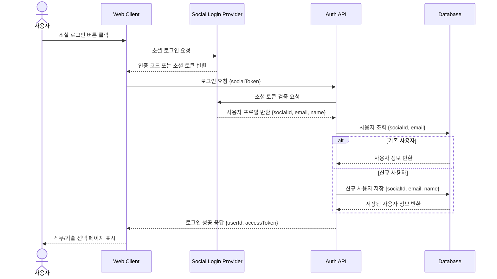

# 01. 소셜 로그인 시퀀스

## 목적

사용자가 소셜 로그인을 통해 서비스에 진입하고, 서버가 사용자 정보를 확인한 뒤 신규 사용자와 기존 사용자를 구분하여 처리하는 흐름을 표현한다.

## 관련 화면

- [[01_메인_로그인]]
- [[02_직무_기술_선택]]

## 참여 객체

| 객체 | 역할 |
|---|---|
| 사용자 | 소셜 로그인 버튼을 클릭하는 주체 |
| Web Client | 로그인 요청을 시작하고 로그인 결과에 따라 화면을 이동 |
| Social Login Provider | Google, Kakao, Naver 등 외부 인증 제공자 |
| Auth API | 소셜 토큰 검증, 사용자 조회, 회원가입/로그인 처리 |
| Database | 사용자 정보 저장 및 조회 |

## Mermaid 시퀀스 다이어그램



## API 메모

### POST /api/auth/social-login

#### Request

```json
{
  "provider": "google",
  "socialToken": "string"
}
```

#### Response

```json
{
  "userId": 1,
  "accessToken": "string",
  "isNewUser": false
}
```

## 예외 상황

| 상황 | 처리 |
|---|---|
| 소셜 토큰 만료 | 로그인 실패 메시지 표시 |
| 사용자 정보 조회 실패 | 재시도 안내 |
| 신규 사용자 저장 실패 | 서버 오류 메시지 표시 |
