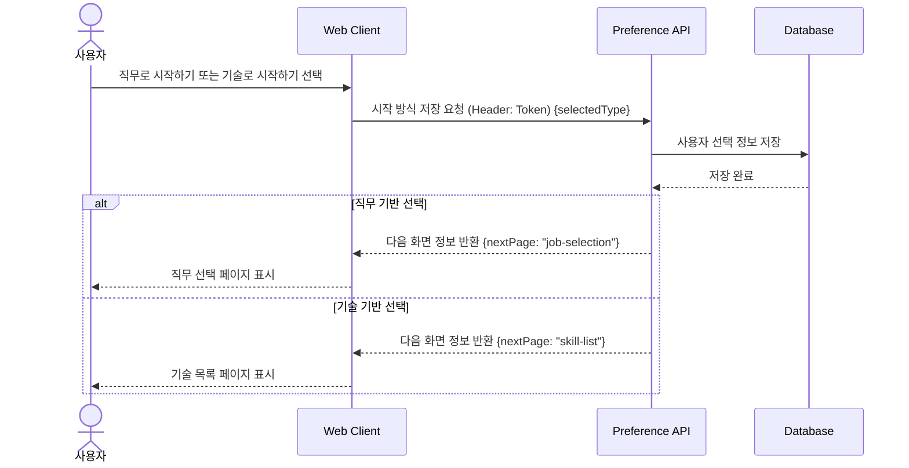

# 02. 직무/기술 선택 시퀀스

## 목적

로그인한 사용자가 학습 탐색 방식을 `직무 기반` 또는 `기술 기반` 중 하나로 선택하고, 선택 결과에 따라 다음 화면으로 분기되는 흐름을 표현한다.

## 관련 화면

- [[02_직무_기술_선택]]
- [[03_직무_선택]]
- [[05_기술_목록]]

## 참여 객체

| 객체 | 역할 |
|---|---|
| 사용자 | 직무 또는 기술 탐색 방식을 선택 |
| Web Client | 선택지를 표시하고 선택 결과를 서버로 전송 |
| Preference API | 사용자의 시작 방식 선택을 저장 |
| Database | 사용자 선택 정보 저장 |

## Mermaid 시퀀스 다이어그램



## API 메모

### POST /api/users/me/preference

#### Request

```json
{
  "selectedType": "JOB"
}
```

#### Response

```json
{
  "userId": 1,
  "selectedType": "JOB",
  "nextPage": "job-selection"
}
```

## 예외 상황

| 상황 | 처리 |
|---|---|
| 선택값 누락 | 선택 요청 메시지 표시 |
| 로그인 세션 만료 | 로그인 페이지로 이동 |
