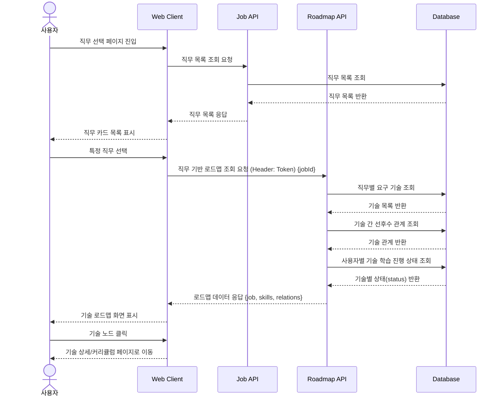

# 03. 직무 선택 및 로드맵 조회 시퀀스

## 목적

사용자가 관심 직무를 선택하면, 해당 직무에 필요한 기술 목록과 기술 간 선후수 관계를 조회하여 로드맵 화면에 표시하는 흐름을 표현한다.

## 관련 화면

- [[03_직무_선택]]
- [[04_직무_로드맵]]
- [[06_기술_상세_커리큘럼]]

## 참여 객체

| 객체 | 역할 |
|---|---|
| 사용자 | 직무를 선택하고 로드맵을 확인 |
| Web Client | 직무 목록 및 로드맵 데이터를 화면에 표시 |
| Job API | 직무 목록 조회 |
| Roadmap API | 직무별 요구 기술 및 관계 조회 |
| Database | 직무, 기술, 기술 관계 데이터 저장 |

## Mermaid 시퀀스 다이어그램



## API 메모

### GET /api/jobs

#### Response

```json
[
  {
    "jobId": 1,
    "jobName": "AI Agent Developer",
    "description": "AI Agent 서비스를 설계하고 구현하는 직무"
  }
]
```

### GET /api/jobs/{jobId}/roadmap

#### Response

```json
{
  "jobId": 1,
  "jobName": "AI Agent Developer",
  "skills": [
    {
      "skillId": 1,
      "skillName": "Python",
      "status": "NOT_STARTED"
    },
    {
      "skillId": 2,
      "skillName": "SQL",
      "status": "IN_PROGRESS"
    }
  ],
  "relations": [
    {
      "fromSkillId": 1,
      "toSkillId": 2,
      "relationType": "PREREQUISITE"
    }
  ]
}
```

## 예외 상황

| 상황 | 처리 |
|---|---|
| 직무 목록 없음 | “등록된 직무가 없습니다” 표시 |
| 로드맵 데이터 없음 | 기본 추천 기술 또는 관리자 문의 안내 |
| 기술 노드 클릭 실패 | 기술 상세 페이지 이동 실패 메시지 표시 |
