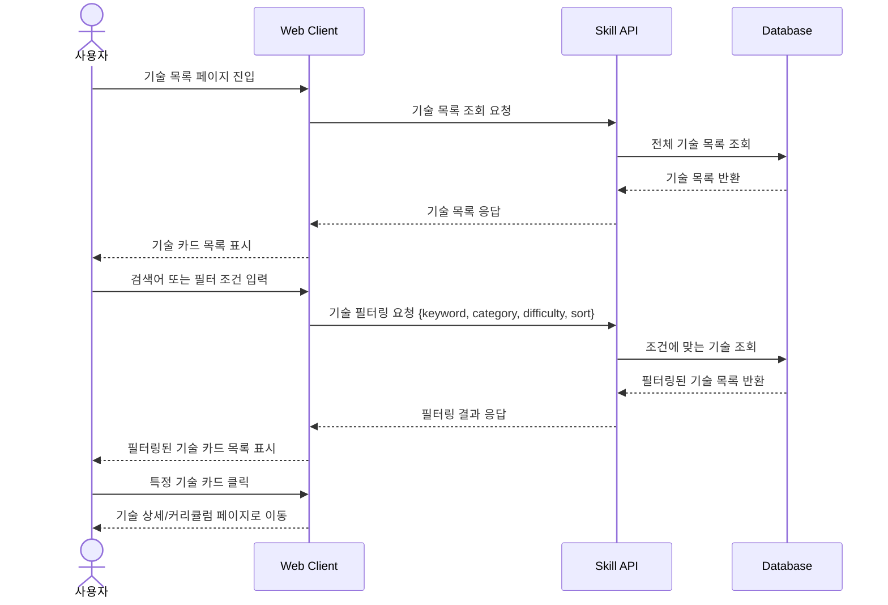

# 04. 기술 목록 조회 및 필터링 시퀀스

## 목적

사용자가 기술 기반 탐색을 선택했을 때, 전체 기술 목록을 조회하고 검색어 또는 필터 조건에 따라 기술 목록을 갱신하는 흐름을 표현한다.

## 관련 화면

- [[05_기술_목록]]
- [[06_기술_상세_커리큘럼]]

## 참여 객체

| 객체 | 역할 |
|---|---|
| 사용자 | 기술 목록 조회, 검색, 필터링, 기술 선택 |
| Web Client | 검색창, 필터, 기술 카드 목록 표시 |
| Skill API | 기술 목록 조회 및 필터링 |
| Database | 기술, 카테고리, 난이도, 관련 직무 데이터 저장 |

## Mermaid 시퀀스 다이어그램



## API 메모

### GET /api/skills

#### Query Parameters

```text
keyword=python
category=programming
difficulty=beginner
sort=recommended
```

#### Response

```json
[
  {
    "skillId": 1,
    "skillName": "Python",
    "description": "데이터 분석과 AI 개발에 활용되는 프로그래밍 언어",
    "category": "Programming",
    "difficulty": "BEGINNER",
    "relatedJobs": ["Data Scientist", "AI Agent Developer"]
  }
]
```

## 예외 상황

| 상황 | 처리 |
|---|---|
| 검색 결과 없음 | “검색 결과가 없습니다” 표시 |
| 필터 조건 충돌 | 필터 초기화 버튼 제공 |
| 기술 상세 이동 실패 | 오류 메시지 표시 |
