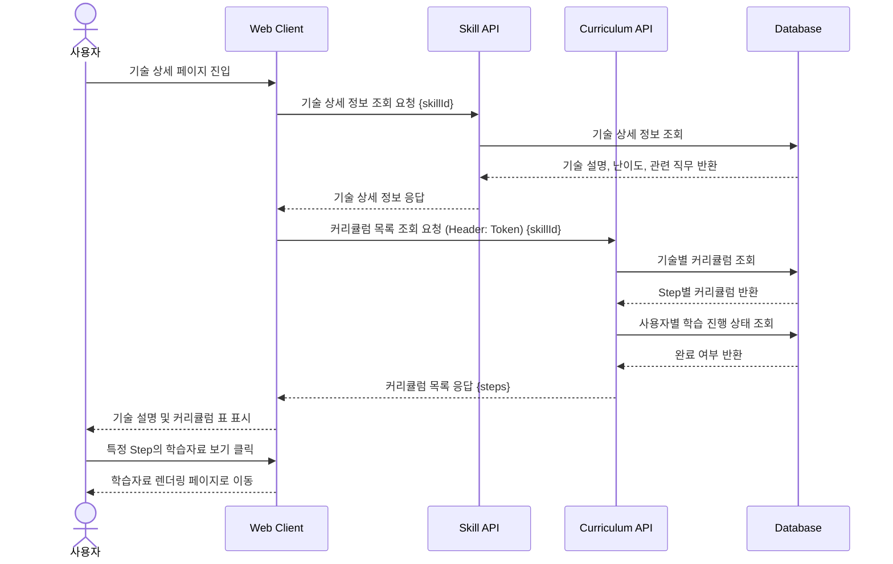

# 05. 기술 상세 및 커리큘럼 조회 시퀀스

## 목적

사용자가 특정 기술을 선택하면 기술 상세 정보와 단계별 커리큘럼을 조회하여 표시하는 흐름을 표현한다.

## 관련 화면

- [[06_기술_상세_커리큘럼]]
- [[07_학습자료]]

## 참여 객체

| 객체 | 역할 |
|---|---|
| 사용자 | 기술 상세 정보와 커리큘럼 확인 |
| Web Client | 기술 설명, 메타 정보, 커리큘럼 표 표시 |
| Skill API | 기술 상세 정보 조회 |
| Curriculum API | 기술별 커리큘럼 목록 조회 |
| Database | 기술, 커리큘럼, 사용자 학습 상태 저장 |

## Mermaid 시퀀스 다이어그램



## API 메모

### GET /api/skills/{skillId}

#### Response

```json
{
  "skillId": 1,
  "skillName": "Python",
  "description": "Python은 데이터 분석, AI, 백엔드 개발에 널리 사용되는 언어입니다.",
  "difficulty": "BEGINNER",
  "estimatedTime": "10 hours",
  "relatedJobs": ["Data Scientist", "AI Agent Developer"]
}
```

### GET /api/skills/{skillId}/curriculums

#### Response

```json
[
  {
    "curriculumId": 1,
    "step": 1,
    "title": "Python 기본 문법",
    "objectives": "변수, 조건문, 반복문을 이해한다.",
    "keywords": ["variable", "if", "loop"],
    "isCompleted": false
  }
]
```

## 예외 상황

| 상황 | 처리 |
|---|---|
| 기술 정보 없음 | 기술 목록 페이지로 이동 |
| 커리큘럼 없음 | “아직 등록된 커리큘럼이 없습니다” 표시 |
