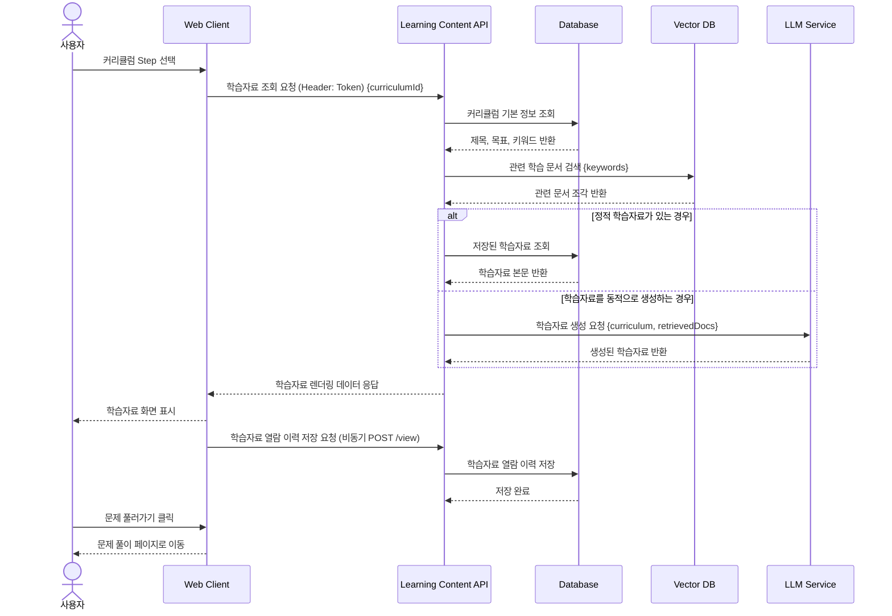

# 06. 학습자료 렌더링 시퀀스

## 목적

사용자가 커리큘럼 Step을 선택하면 해당 학습 주제에 맞는 학습자료를 조회하고, 필요한 경우 Vector DB를 통해 관련 문서를 검색하여 학습자료 화면에 표시하는 흐름을 표현한다.

## 관련 화면

- [[07_학습자료]]
- [[08_문제풀이]]

## 참여 객체

| 객체 | 역할 |
|---|---|
| 사용자 | 커리큘럼 Step을 선택하고 학습자료 확인 |
| Web Client | 학습자료 본문, 목차, 진행률 표시 |
| Learning Content API | 학습자료 조회 및 구성 |
| Database | 커리큘럼 기본 정보와 학습 이력 저장 |
| Vector DB | 외부 문서 또는 강의자료 검색 |
| LLM Service | 선택 사항. 검색된 문서를 바탕으로 학습자료 생성 또는 요약 |

## Mermaid 시퀀스 다이어그램



## API 메모

### GET /api/curriculums/{curriculumId}/content

#### Response

```json
{
  "curriculumId": 1,
  "title": "Python 기본 문법",
  "content": "학습자료 본문",
  "references": [
    {
      "title": "Python Official Tutorial",
      "url": "https://docs.python.org/3/tutorial/"
    }
  ],
  "progress": {
    "viewed": true,
    "completed": false
  }
}
```

## 예외 상황

| 상황 | 처리 |
|---|---|
| 관련 문서 없음 | 기본 학습자료 표시 |
| LLM 생성 실패 | 저장된 정적 자료 또는 오류 메시지 표시 |
| 학습 이력 저장 실패 | 화면은 표시하되 재시도 처리 |
