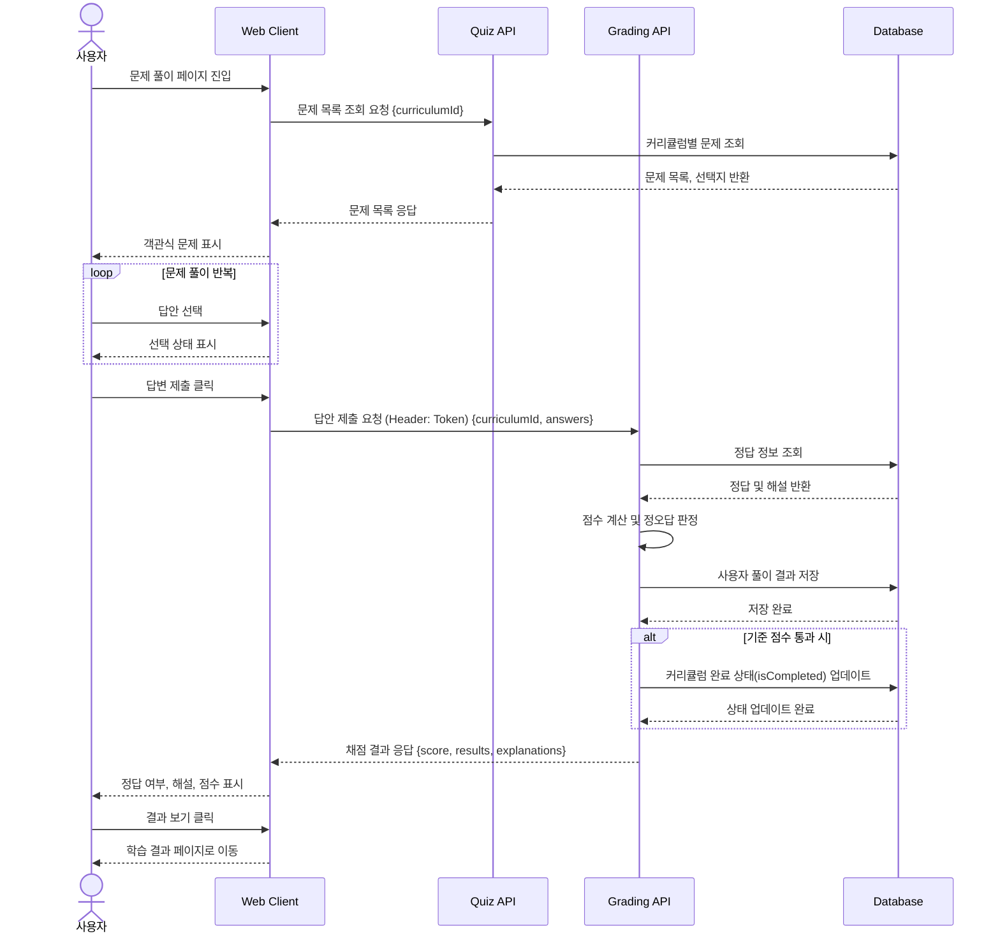

# 07. 문제풀이 및 채점 시퀀스

## 목적

사용자가 학습자료를 확인한 뒤 문제를 풀고, 답안을 제출하면 서버가 채점 후 결과와 해설을 반환하는 흐름을 표현한다.

## 관련 화면

- [[08_문제풀이]]
- [[09_학습결과]]

## 참여 객체

| 객체 | 역할 |
|---|---|
| 사용자 | 문제를 풀고 답안을 제출 |
| Web Client | 문제, 선택지, 제출 버튼, 결과 영역 표시 |
| Quiz API | 문제 목록 조회 |
| Grading API | 답안 채점 및 결과 저장 |
| Database | 문제, 선택지, 정답, 풀이 결과 저장 |

## Mermaid 시퀀스 다이어그램



## API 메모

### GET /api/curriculums/{curriculumId}/quizzes

#### Response

```json
[
  {
    "quizId": 1,
    "question": "Python에서 리스트를 생성하는 올바른 방법은?",
    "options": [
      {
        "optionId": 1,
        "text": "[1, 2, 3]"
      },
      {
        "optionId": 2,
        "text": "{1, 2, 3}"
      }
    ]
  }
]
```

### POST /api/quizzes/submit

#### Request

```json
{
  "curriculumId": 1,
  "answers": [
    {
      "quizId": 1,
      "selectedOptionId": 1
    }
  ]
}
```

#### Response

```json
{
  "score": 80,
  "results": [
    {
      "quizId": 1,
      "isCorrect": true,
      "correctOptionId": 1,
      "explanation": "Python 리스트는 대괄호를 사용하여 생성합니다."
    }
  ]
}
```

## 예외 상황

| 상황 | 처리 |
|---|---|
| 문제 없음 | “등록된 문제가 없습니다” 표시 |
| 답안 미선택 | 제출 전 선택 요청 |
| 채점 실패 | 재제출 안내 |
