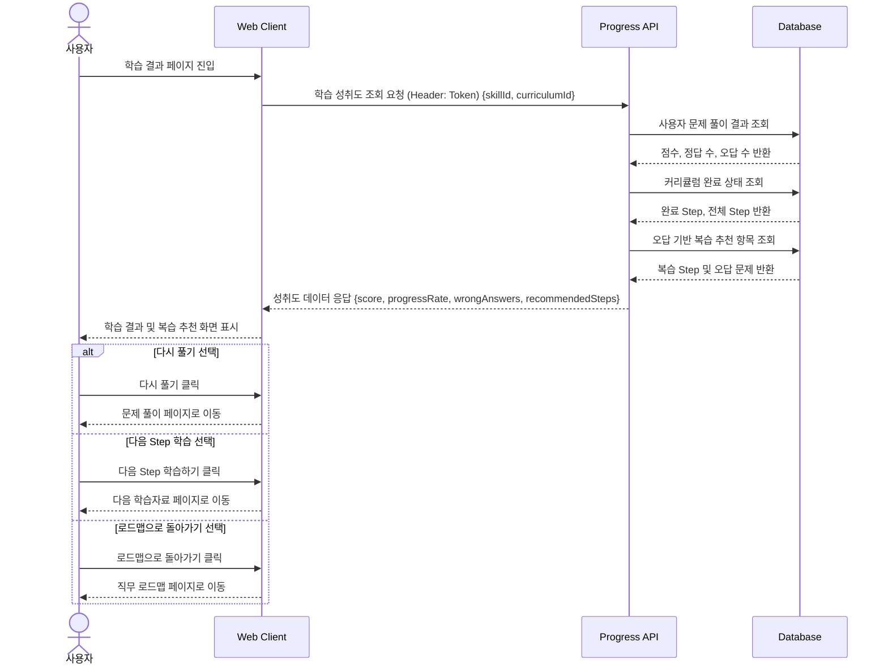

# 08. 학습결과 및 성취도 조회 시퀀스

## 목적

문제 풀이가 끝난 뒤 사용자의 점수, 정답 수, 오답 수, 커리큘럼 완료율, 복습 추천 항목을 조회하여 학습 결과 화면에 표시하는 흐름을 표현한다.

## 관련 화면

- [[09_학습결과]]
- [[04_직무_로드맵]]
- [[06_기술_상세_커리큘럼]]

## 참여 객체

| 객체 | 역할 |
|---|---|
| 사용자 | 학습 결과와 추천 복습 항목 확인 |
| Web Client | 점수, 완료율, 오답 목록, 추천 Step 표시 |
| Progress API | 사용자 학습 성취도 조회 |
| Database | 학습 이력, 풀이 결과, 커리큘럼 완료 상태 저장 |

## Mermaid 시퀀스 다이어그램



## API 메모

### GET /api/users/me/progress

#### Query Parameters

```text
skillId=1
curriculumId=1
```

#### Response

```json
{
  "userId": 1,
  "skillId": 1,
  "curriculumId": 1,
  "score": 80,
  "correctCount": 4,
  "wrongCount": 1,
  "progressRate": 60,
  "wrongAnswers": [
    {
      "quizId": 3,
      "question": "반복문에 대한 설명 중 틀린 것은?",
      "explanation": "for문과 while문은 반복 조건을 처리하는 방식이 다릅니다."
    }
  ],
  "recommendedSteps": [
    {
      "curriculumId": 2,
      "title": "Python 반복문 심화"
    }
  ]
}
```

## 예외 상황

| 상황 | 처리 |
|---|---|
| 학습 결과 없음 | 기본 상태 또는 학습 시작 안내 표시 |
| 오답 없음 | “모든 문제를 맞혔습니다” 표시 |
| 추천 항목 없음 | 다음 Step 학습 버튼 표시 |
