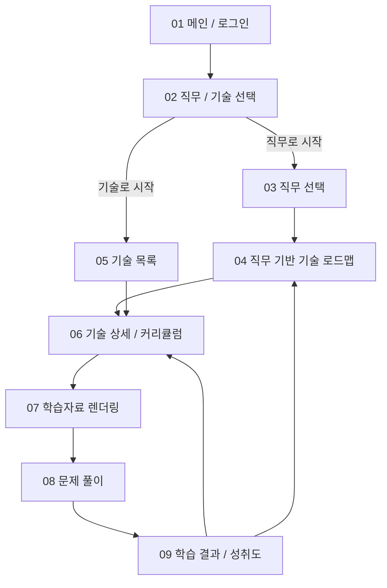

# 화면 전환 흐름

## 전환 조건

| From | To | 조건 |
|---|---|---|
| 메인 / 로그인 | 직무 / 기술 선택 | 로그인 성공 |
| 직무 / 기술 선택 | 직무 선택 | 직무로 시작하기 클릭 |
| 직무 / 기술 선택 | 기술 목록 | 기술로 시작하기 클릭 |
| 직무 선택 | 직무 로드맵 | 직무 선택 완료 |
| 직무 로드맵 | 기술 상세 | 기술 노드 클릭 |
| 기술 목록 | 기술 상세 | 기술 카드 클릭 |
| 기술 상세 | 학습자료 | 커리큘럼 Step 클릭 |
| 학습자료 | 문제 풀이 | 문제 풀러가기 클릭 |
| 문제 풀이 | 학습 결과 | 답변 제출 완료 |
