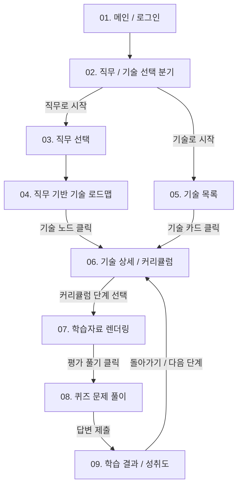

# JobFit 서비스 개요 (v2 - Django 통합 풀스택)

## 1. 서비스 목적

JobFit은 사용자가 관심 있는 **직무(Job)** 또는 **기술(Skill)**을 기준으로 최적의 맞춤형 학습을 시작할 수 있도록 돕는 **직무·기술 기반 학습 로드맵 및 평가 서비스**입니다.

사용자는 소셜 로그인을 통해 서비스에 진입한 뒤, 다음 두 가지 방식 중 하나를 선택하여 학습 여정을 시작합니다.

*   **직무 기반 탐색:** 관심 직무(예: Data Scientist, AI Agent Developer)를 선택하고, 해당 직무에 필요한 기술 로드맵(DAG 구조)을 확인하며 학습합니다.
*   **기술 기반 탐색:** 특정 기술(예: Python, React, Docker)을 직접 선택하고, 해당 기술의 상세 설명과 단계별 커리큘럼을 즉시 확인합니다.

이후 사용자는 기술별 커리큘럼 단계에 따라 학습자료를 정독하고, 최종 **개념 평가 퀴즈(Quiz)**를 풀이하여 이해도를 점검하고 성취도를 누적 기록합니다.

---

## 2. 핵심 사용자 흐름 (User Flow)

---

## 3. 주요 기능 목록

| 구분 | 기능명 | 설명 | 비고 |
|---|---|---|---|
| **인증** | 소셜 로그인 | Google, Kakao, Naver 소셜 로그인 및 세션 생성 | Django Session 기반 |
| **탐색** | 직무 선택 | IT 및 AI 핵심 직무 검색, 분야 필터링 및 선택 | `UserProfile`에 연동 |
| **추천** | 다중 루트 기술 로드맵 | 직무별 필요 기술들을 다중 시작점(Multiple Roots) 및 선행 의존성(DAG)으로 드로잉 | SVG + CSS Grid 동적 렌더링 |
| **학습** | 기술 상세 & 커리큘럼 | 기술의 난이도, 예상 시간과 단계별(Step 1~4) 커리큘럼 테이블 제공 | 100% DB 연동 |
| **콘텐츠** | 학습자료 렌더링 | 마크다운 포맷의 기술 개념, 예시 코드 블록 등을 미려하게 화면에 렌더링 | `/learning/material` |
| **평가** | 퀴즈 풀이 | 커리큘럼 기반 4지 선다형 객관식 퀴즈 풀이, 실시간 채점 및 오답 확인 | `QuizQuestion`, `QuizChoice` |
| **기록** | 학습 진행 및 성취도 관리 | 사용자별 학습 완료 상태, 퀴즈 득점, 정/오답 기록 저장 및 분석 | `QuizAttempt`, `UserResponse` |

---

## 4. 화면 및 뷰(View) 맵핑 리스트

| 번호 | 화면명 | 매핑 템플릿 파일 | 주요 데이터 Context (DB) |
|---|---|---|---|
| **01** | [메인 / 로그인](pages/01_메인_로그인.md) | `landing.html` | 없음 (정적 소개 및 소셜 인증 링크) |
| **02** | [직무 / 기술 선택](pages/02_직무_기술_선택.md) | `mode_select.html` | `user_profile` |
| **03** | [직무 선택](pages/03_직무_선택.md) | `job_select.html` | `jobs` (직무 리스트, AI 생성 썸네일 경로 포함) |
| **04** | [직무 기반 기술 로드맵](pages/04_직무_로드맵.md) | `job_roadmap.html` | `job`, `roadmap_nodes` (선행 의존성, 완료 상태 매핑) |
| **05** | [기술 목록](pages/05_기술_목록.md) | `skill_list.html` | `skills` (전체 기술 목록, 검색/필터 데이터, Devicon 연동 코드) |
| **06** | [기술 상세 / 커리큘럼](pages/06_기술_상세_커리큘럼.md) | `skill_detail.html` | `skill`, `curriculums` (단계별 챕터 리스트 및 완료 상태) |
| **07** | [학습자료 렌더링](pages/07_학습자료.md) | `learning_material.html` | `curriculum`, `progress` (마크다운 콘텐츠, 진도율) |
| **08** | [문제 풀이](pages/08_문제풀이.md) | `quiz_play.html` | `quiz_questions`, `quiz_choices` |
| **09** | [학습 결과 / 성취도](pages/09_학습결과.md) | `quiz_result.html` | `attempt`, `wrong_answers`, `recommendations` (오답 풀이 및 추천 복습 단계) |

---

## 5. 설계 핵심 원칙

1.  **Django 통합 뷰 렌더링:**
    *   REST API와 프론트엔드 라우팅을 분리하는 대신, Django의 뷰가 URL 매핑을 받아 직접 데이터베이스를 조회하고 컨텍스트를 담아 HTML 템플릿을 완성하여 클라이언트에 쏩니다.
2.  **데이터 기반 이미지/아이콘 관리:**
    *   아이콘 및 썸네일 경로를 소스 코드에 하드코딩하지 않고, `Job.job_image_url`(AI 생성 일러스트 파일)과 `Skill.skill_icon_code`(Devicon/Lucide용 매핑 문자열) 컬럼을 DB에서 직접 관리하여 유연하게 노출합니다.
3.  **수동 학습 순서 제거 및 DAG 위상 정렬:**
    *   임의의 `learning_order`를 수동 지정하는 대신, `Roadmap.prerequisite_skill_id`를 기반으로 구성된 방향성 비순환 그래프(DAG) 구조를 백엔드/프론트엔드에서 **위상 정렬(Topological Sort)**하여 최적의 학습 순서를 동적으로 자동 렌더링합니다.
