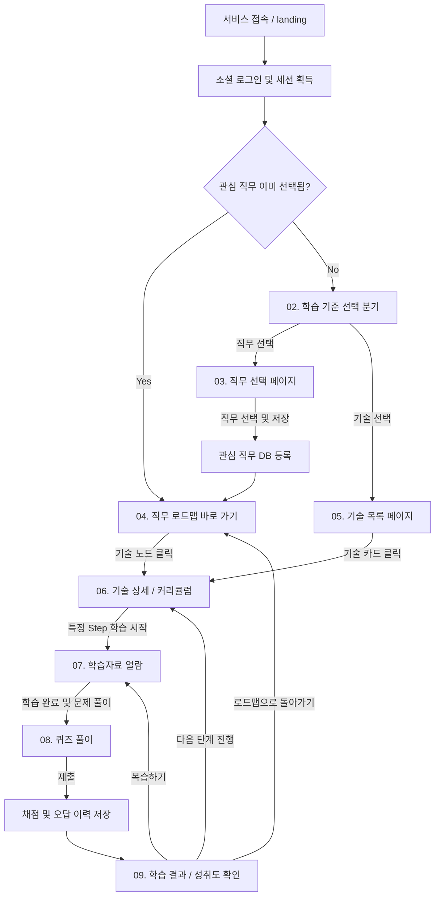

# 사용자 흐름 (v2 - Django 통합 풀스택)

본 문서는 **JobFit**의 핵심 사용자 시나리오와 각 흐름에서 발생하는 상태(State) 저장 규칙을 정의합니다.

---

## 1. 전체 사용자 흐름도

---

## 2. 세부 시나리오 흐름

### A. 직무 기반 로드맵 학습 흐름
1.  **로그인 및 대시보드 진입:** 사용자가 소셜 계정으로 로그인합니다.
2.  **학습 모드 선택:** "무엇을 기준으로 공부할까요?" 분기에서 `직무로 시작하기`를 누릅니다.
3.  **관심 직무 등록:** AI Agent Developer, Data Scientist 등의 직무 중 하나를 선택하고 `선택 완료`를 누릅니다. (DB `UserSelectedJob` 테이블에 영속적으로 등록)
4.  **로드맵 브라우징:** 선택한 직무에 매핑된 다중 루트 기술 로드맵(SVG)을 통해 선행 기술 구조와 현재 본인의 학습 진척도(미시작/진행중/완료)를 직관적으로 확인합니다.
5.  **기술 커리큘럼 선택:** 배우고자 하는 기술 노드(예: Pandas)를 선택해 상세 페이지로 들어갑니다.
6.  **학습자료 정독:** Step 1부터 순서대로 학습자료를 읽으며 지식을 얻습니다. (학습자료 열람 시 `UserCurriculumProgress` 상태가 `in_progress`로 갱신되며 진도율이 올라감)
7.  **퀴즈 응시:** 학습자료 하단의 `퀴즈 풀고 검증하기`를 눌러 퀴즈에 응시합니다.
8.  **채점 및 피드백:** 4지 선다형 문항들을 풀이한 뒤 답변을 제출하면, 즉시 백엔드에서 자동 채점 및 리뷰 화면을 렌더링해 줍니다. 70점 이상 획득 시 해당 노드의 마스터리 획득 및 `UserCurriculumProgress`가 `completed`로 최종 전환됩니다.

### B. 기술 기반 직접 탐색 학습 흐름
1.  **로그인 및 대시보드 진입:** 사용자가 소셜 계정으로 로그인합니다.
2.  **학습 모드 선택:** "무엇을 기준으로 공부할까요?" 분기에서 `기술로 시작하기`를 누릅니다.
3.  **기술 검색 및 필터링:** 전체 기술 리스트에서 분야(Frontend, Backend, Data, Infra 등) 및 난이도별로 필터를 걸어 원하는 기술을 탐색합니다.
4.  **커리큘럼 진입:** 카드를 선택하여 바로 상세 단계(Step 1~4) 및 학습 자료 페이지로 진입하여 학습과 퀴즈를 전개합니다.

---

## 3. 데이터베이스 상태(State) 저장 시점 및 매핑 규칙

각 사용자 액션에 대해 데이터베이스에 영속화(Persist)되는 규칙은 다음과 같습니다.

| 사용자 행동 (Action) | 영속화 시점 (Trigger) | 타겟 테이블 (DB) | 저장/갱신되는 데이터 상세 |
|---|---|---|---|
| **소셜 로그인** | 인증 성공 및 첫 가입 시 | `UserProfile` | 가입 제공자(`provider`), 소셜 고유 ID(`social_id`), 이메일, 이름, 프로필 사진 URL |
| **관심 직무 등록** | 직무 선택 완료 버튼 클릭 시 | `UserSelectedJob` | 로그인 유저 ID, 선택한 `job_id`, 선택 일시 |
| **학습자료 열람** | 학습 자료 뷰어 페이지 진입 및 스크롤 시 | `UserCurriculumProgress` | `user_profile_id`, `curriculum_id`, 진행률(`progress` % 증가), 진행 상태(`status` = 'in_progress') |
| **퀴즈 제출 및 채점** | 문제 풀이 후 최종 '답변 제출' 버튼 클릭 시 | `QuizAttempt` | `user_profile_id`, `curriculum_id`, 채점 결과 점수(`score` 0~100) |
| **오답 리포트 저장** | 퀴즈 채점과 동시에 자동 실행 | `UserResponse` | `quiz_attempt_id`, 풀이한 각 문항 ID(`question_id`), 유저가 선택한 선택지 ID(`selected_choice_id`), 정/오답 여부(`is_correct`) |
| **마스터리 획득** | 퀴즈 80점 이상으로 통과 시 | `UserCurriculumProgress` | 해당 커리큘럼의 진행 상태(`status` = 'completed'), 진행도 `100`으로 업데이트 |
