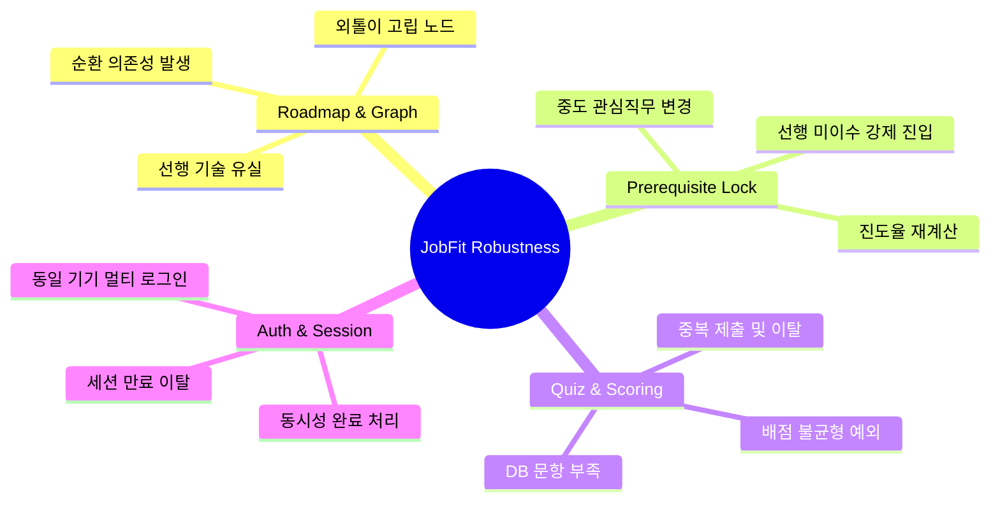

# 개발 의사결정 02. 안정적인 개발을 위한 예외 시나리오 및 테스트 케이스(Test Case) 명세서

본 문서는 **JobFit** 통합 풀스택 서비스 개발에 착수하기 전, 기획 명세서와 데이터베이스 설계 단계에서 미처 간과하기 쉬운 **논리적 예외 상황, 엣지 케이스(Edge Cases), 시스템의 취약 지점**을 미리 발굴하고 이를 방지하기 위한 정밀 테스트 케이스 및 예외 방어 설계 가이드라인입니다.

---

## 🚀 4대 핵심 검증 영역

---

## 1. 직무 로드맵(DAG) 시각화 및 데이터 구조 예외 검토

### TC-ROAD-01: 순환 의존성(Circular Dependency) 데이터 오류
*   **상황:** 관리자 실수나 데이터 적재 과정에서 `기술 A ➔ 기술 B`가 선행 관계인데, 동시에 `기술 B ➔ 기술 A`가 선행 관계로 등록된 경우 (순환 루프 발생)
*   **시스템 영향:** Vis.js 그래프 렌더링 무한 루프, 또는 백엔드 위상 정렬(Topological Sort) 알고리즘 시 Stack Overflow / infinite recursion 발생 가능
*   **검증 절차:**
    1.  `Roadmap` 테이블에 `A(선행: B)`와 `B(선행: A)`인 데이터를 임의 삽입한다.
    2.  `/jobs/<job_id>/roadmap/` 에 접속한다.
    3.  **기대 결과:** 시스템이 다운되지 않고, 백엔드 위상 정렬 루프 감지기(Cycle Detector)가 작동하여 500 에러 대신 "로드맵 구조 오류가 감지되었습니다."라는 경고 메시지를 로그에 기록하며 화면에는 의존성 선을 제외한 노드만 렌더링한다.

### TC-ROAD-02: 직무에 포함되지 않은 선행 기술 참조 (Orphan Prerequisite)
*   **상황:** `Data Scientist` 직무 로드맵에 `Pandas` 기술이 포함되어 있고 Pandas의 선행 기술이 `Python`으로 지정되어 있으나, 정작 `Python` 기술은 `Data Scientist` 직무에 배치 등록을 깜빡한 경우
*   **시스템 영향:** 로드맵 캔버스에 존재하지 않는 Python 노드를 향해 선을 그리려다 스크립트 에러 발생 가능
*   **검증 절차:**
    1.  `Roadmap` 테이블에 `Pandas` 노드를 생성하고 `prerequisite_skill_id`를 `Python`으로 지정하되, `Python`은 해당 직무에 매핑하지 않는다.
    2.  로드맵 화면을 불러온다.
    3.  **기대 결과:** `Python`이 직무 로드맵에 없으므로 의존성 선(Edge)을 그리지 않고, `Pandas` 노드를 최상단 시작점(Root)으로 안전하게 승격하여 렌더링한다.

---

## 2. 선행 학습 잠금 및 사용자 진행도 검증

### TC-LOCK-01: 선행 미이수 기술로의 URL 강제 우회 진입 시도
*   **상황:** 직무 로드맵 UI에서는 선행 기술(Python)을 이수하지 않아 후행 기술(Pandas) 노드가 회색으로 비활성화(Locked)되어 클릭이 막혀 있으나, 영악한 사용자가 브라우저 주소창에 직접 `/skills/Pandas_ID/` 혹은 `/curriculums/Pandas_Step_ID/material/`을 쳐서 우회 진입을 시도하는 경우
*   **시스템 영향:** 선행 학습을 건너뛰고 심화 학습 및 퀴즈 마스터리를 강제 획득하여 학습 위계 질서가 파괴됨
*   **검증 절차:**
    1.  Python 노드를 미완료(`not_started`)한 유저 세션으로 접속한다.
    2.  주소창에 후행 노드인 Pandas 상세 URL `/skills/2/`로 직접 강제 진입을 요청한다.
    3.  **기대 결과:** Django View 내부의 'Prerequisite Validator'가 작동하여 요청을 차단하고, "선행 기술인 'Python'을 먼저 완료해야 학습할 수 있습니다."라는 경고 메시지와 함께 로드맵 화면으로 리다이렉트한다.

### TC-LOCK-02: 학습 중도에 관심 직무 변경 (Mid-Study Job Switch)
*   **상황:** 사용자가 `Data Scientist` 직무 로드맵에서 `Python`과 `Pandas`를 완료하고 퀴즈 마스터리(완료 상태)를 획득한 후, 갑자기 관심 직무를 `AI Agent Developer`로 변경한 경우
*   **시스템 영향:** 새로 변경한 직무 로드맵에서도 이전에 획득한 공통 기술(`Python`)의 마스터리 완료 상태가 안전하게 유지 및 이관되는지 여부
*   **검증 절차:**
    1.  유저가 `Data Scientist` 상태에서 `Python` 퀴즈를 합격하여 완료(`completed`) 상태로 만든다.
    2.  직무 선택 화면으로 이동하여 관심 직무를 `AI Agent Developer`로 교체한다.
    3.  새로운 직무 로드맵 화면에 진입한다.
    4.  **기대 결과:** 관심 직무 매핑 테이블(`UserSelectedJob`)은 변경되었지만, 핵심 학습 이력인 `UserCurriculumProgress`와 `QuizAttempt`는 유저 프로필 고유 ID에 귀속되어 있으므로, 새로운 로드맵의 `Python` 노드 역시 완료(`completed`) 상태인 녹색으로 정상 표시된다.

---

## 3. 가중치 퀴즈 및 동적 채점 예외 검토 (핵심 영역)

### TC-QUIZ-01: 특정 난이도의 DB 문항 부족 상황 (Underflow Questions)
*   **상황:** 기획안에 따라 퀴즈는 항상 **쉬움 2개, 중간 2개, 어려움 1개**를 추출하여 출제해야 함. 그러나 관리자가 새로 등록한 `TensorFlow` 기술에 대해 깜빡하고 **어려움** 난이도 문항을 0개, 혹은 **쉬움** 문항을 1개만 등록해 둔 경우
*   **시스템 영향:** `QuizPlayView` 로딩 시 5개 문항을 채우지 못해 총점이 100점 미만으로 깎이거나, 아웃오브인덱스(Index Error)로 뷰 렌더링에 실패함. 
*   **검증 절차:**
    1.  특정 기술에 대해 쉬움 1개, 중간 2개만 DB에 등록한다. (어려움은 0개)
    2.  해당 기술의 퀴즈 진입 요청을 보낸다.
    3.  **기대 결과 (방어 설계):**
        *   **A안 (경고 리다이렉트):** "문항 수가 부족하여 테스트를 진행할 수 없습니다. 관리자에게 문의하세요." 경고 노출 후 이전 페이지 리다이렉트 (추천)
        *   **B안 (동적 배점 재분배):** 있는 문항(3개)만 추출하되, 배점을 만점인 100점에 맞춰 동적으로 비율 재배치 후 채점 진행

### TC-QUIZ-02: 브라우저 뒤로가기를 통한 퀴즈 중복 제출 시도
*   **상황:** 사용자가 퀴즈를 풀고 최종 제출하여 50점을 획득해 '탈락'한 후, 브라우저의 `뒤로가기` 버튼을 눌러 이전 작성 상태의 퀴즈 폼으로 돌아가 정답만 고쳐서 재제출하려는 경우
*   **시스템 영향:** 비정상적으로 단번에 100점 마스터리를 획득하게 됨
*   **검증 절차:**
    1.  사용자가 퀴즈 풀이를 완료하고 결과 화면 `/quiz/attempts/45/result/`에 도달한다.
    2.  뒤로가기를 눌러 작성 중 화면 `/curriculums/10/quiz/`로 강제 복귀한다.
    3.  답변을 수정하고 재제출을 누른다.
    4.  **기대 결과:** POST 뷰에서 세션의 일회성 CSRF 토큰 혹은 퀴즈 상태 토큰을 검증하거나, 이미 해당 Attempt가 제출 완료 상태임을 감지하여 "이미 제출이 완료된 평가 시도입니다." 경고를 노출하고 재제출을 원천 무효화 처리한다.

### TC-QUIZ-03: 퀴즈 풀이 도중 브라우저 탭 종료 및 이탈
*   **상황:** 5문제 중 3번 문제까지 풀고 있는 상태에서 사용자가 브라우저 창을 닫거나 컴퓨터가 꺼진 경우
*   **시스템 영향:** 불완전한 퀴즈 풀이 상태로 인해 데이터 정합성 깨짐 혹은 진도율 꼬임 발생 가능
*   **검증 절차:**
    1.  퀴즈 시도를 시작하여 `QuizAttempt` 레코드가 생성된다.
    2.  3번 문제 단계에서 사용자가 브라우저를 닫고 이탈한다.
    3.  **기대 결과:** 불완전하게 이탈된 상태이므로 해당 `QuizAttempt`는 최종 완료되지 않은 미제출 상태로 남는다. 사용자가 다시 퀴즈 진입 시 이전 기록을 삭제하고 새로운 `QuizAttempt`를 안전하게 생성하여 시작하도록 처리한다.

---

## 4. 인증, 세션 및 데이터 동시성 검증

### TC-AUTH-01: 학습자료 열람 도중 또는 퀴즈 풀이 도중 세션 만료
*   **상황:** 퀴즈를 열심히 풀고 있는 도중(예: 20분 소요), 세션이 만료되거나 소셜 로그인이 아웃된 상태에서 답변을 제출하는 경우
*   **시스템 영향:** 로그인 계정 유실로 인한 외국인(Anonymous User) 데이터 저장 시도에 따른 Foreign Key Integrity 에러 발생
*   **검증 절차:**
    1.  퀴즈 풀이 화면에 진입한 뒤 임의로 세션 쿠키를 삭제하여 세션을 비운다.
    2.  답변을 마저 체크하고 `답안 제출` 버튼을 누른다.
    3.  **기대 결과:** 장고 뷰의 `login_required` 데코레이터가 POST 처리를 즉각 차단하고, 안전하게 로그인 페이지로 리다이렉트하며 500 내부 에러가 나지 않도록 방어한다.

---

## 5. 결론 및 예외 방어 구현 계획

본 예외 시나리오 명세서에 정의된 엣지 케이스들을 방어하기 위해, 향후 백엔드 코드 작성 시 아래의 **방어적 프로그래밍(Defensive Programming) 기법**을 장고 코드에 필수로 이식하겠습니다.

1.  **위상 정렬 시 Cycle Detection 코드 내장:** 백엔드에서 로드맵 렌더링을 위해 데이터를 계층 구조로 가공할 때 DFS 기반의 순환 감지 알고리즘을 장착하여 무한 루프를 원천 차단합니다.
2.  **데이터베이스 문항 수 예외 처리 로직 구현:** 특정 단원의 문항 수가 `쉬움 2, 중간 2, 어려움 1` 미만일 경우 사용자에게 안전하게 에러 페이지를 렌더링하고 로드맵으로 복귀시킵니다.
3.  **퀴즈 시도 토큰(Once-Token) 검증 도입:** 중복 제출 및 뒤로가기 우회 제출을 막기 위해 퀴즈 세션 고유 토큰이나 이미 채점이 완료된 `QuizAttempt` ID를 비교 대조하여 엄격하게 제어합니다.
