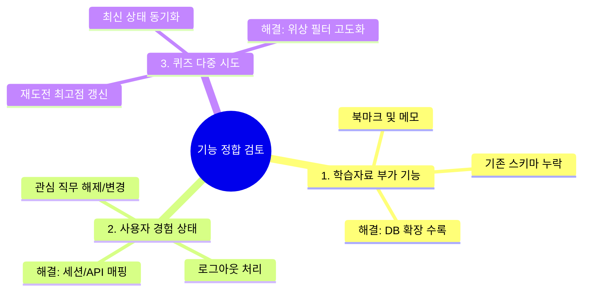

# 개발 의사결정 03. 기능적 기획 누락 사항 검토 및 상세 동작 정의

본 문서는 **JobFit**의 UI/화면 설계서(Obsidian Pages)와 백엔드 데이터베이스/비즈니스 로직 설계 간에 존재할 수 있는 **기능적 공백(Gaps) 및 누락 요소**를 사전에 완벽히 식별하고, 명확한 시스템 동작 정의를 수립하여 설계 일관성을 완성하기 위한 기획 정합 문서입니다.

---

## 🔍 식별된 3대 기능적 공백 및 해결 방안



---

## 1. [누락 1] 학습자료 북마크 및 개인 메모 기능의 데이터 불일치

*   **현상:** 
    *   화면 설계서인 [07_학습자료.md](pages/07_학습자료.md)의 `주요 화면 요소` 섹션에는 `보조 기능 | 북마크, 메모, 이해도 체크`가 명시되어 있습니다.
    *   하지만 기존 [rdb_schema.sql](file:///Users/mesrwi/dev/project/JobFit/database/init/rdb_schema.sql)이나 [decision_01_backend_rebuild_and_schema.md](decision_01_backend_rebuild_and_schema.md) 스키마에는 이를 영속화하기 위한 **북마크 테이블(`UserBookmark`) 및 메모 테이블(`UserNote`)이 완전히 누락**되어 있습니다.
*   **시스템 영향:** 사용자가 화면에서 북마크를 지정하거나 메모를 입력해도 페이지를 새로고침하면 데이터가 모두 날아가 기획 명세에 부합하지 않게 됩니다.
*   **해결 방안 (데이터베이스 추가 설계):**
    사용자의 개인화된 학습 경험을 완벽히 보장하기 위해 다음과 같이 2개의 경량 테이블을 데이터베이스 DDL 설계에 보완 적용합니다.

```sql
-- 12. 사용자 학습자료 북마크 테이블
CREATE TABLE UserBookmark (
    id              SERIAL PRIMARY KEY,
    user_profile_id INT NOT NULL,
    curriculum_id   INT NOT NULL,
    created_at      TIMESTAMP WITH TIME ZONE DEFAULT CURRENT_TIMESTAMP,

    FOREIGN KEY (user_profile_id) REFERENCES UserProfile(id) ON DELETE CASCADE,
    FOREIGN KEY (curriculum_id) REFERENCES Curriculum(id) ON DELETE CASCADE,
    UNIQUE (user_profile_id, curriculum_id) -- 중복 북마크 방지
);

-- 13. 사용자 학습자료 개인 메모 테이블
CREATE TABLE UserNote (
    id              SERIAL PRIMARY KEY,
    user_profile_id INT NOT NULL,
    curriculum_id   INT NOT NULL,
    note_text       TEXT NOT NULL,
    updated_at      TIMESTAMP WITH TIME ZONE DEFAULT CURRENT_TIMESTAMP,

    FOREIGN KEY (user_profile_id) REFERENCES UserProfile(id) ON DELETE CASCADE,
    FOREIGN KEY (curriculum_id) REFERENCES Curriculum(id) ON DELETE CASCADE,
    UNIQUE (user_profile_id, curriculum_id) -- 단원당 1개의 메모장 제공
);
```

---

## 2. [누락 2] 로그아웃(Logout) 및 관심 직무 초기화(Reset)의 흐름 부재

*   **현상:**
    *   모든 헤더(Header) 명세서에 `유저 프로필 카드 및 직무 재설정 링크`가 언급되어 있고 소셜 로그인만 기술되어 있으나, 정작 세션을 해제하는 **로그아웃의 동작 규칙과 주소(URL)**, 그리고 기존 관심 직무 매핑 데이터를 날려주는 **직무 초기화(Reset) 흐름**이 어디에도 명문화되어 있지 않습니다.
*   **시스템 영향:** 사용자가 세션을 종료하고 안전하게 이탈하거나, 다른 직무를 아예 처음부터 다시 고르는 시나리오가 불투명해집니다.
*   **해결 방안 및 동작 정의:**
    *   **로그아웃 뷰 (`/logout/`):**
        *   장고의 `django.contrib.auth.logout`을 실행하여 세션을 안전하게 완전 파괴(Session Destroy)하고, 서비스 초기 진입 화면인 **[01. 메인/로그인 (`landing.html`)]** 으로 안전하게 리다이렉트합니다.
    *   **직무 초기화 뷰 (`/jobs/reset/`):**
        *   사용자가 헤더의 `직무 재설정` 링크를 클릭하면 백엔드 뷰가 실행되어 해당 유저의 `UserSelectedJob` 레코드를 삭제(Delete)하고, 관심 직무를 새롭게 고를 수 있는 **[03. 직무 선택 (`job_select.html`)]** 화면으로 돌려보냅니다.

---

## 3. [누락 3] 퀴즈 다중 시도(Retake)에 따른 진도율/완료 산출 공식

*   **현상:**
    *   사용자는 학습 효율을 위해 퀴즈에 여러 번 도전(`QuizAttempt`가 여러 개 쌓임)할 수 있습니다.
    *   이때, 후행 과목으로 넘어가는 잠금 해제 조건(70점)을 충족할 때 **"사용자가 통과했는지 여부"를 판단하는 명확한 기준 쿼리 룰**이 정리되어 있지 않습니다.
*   **시스템 영향:** 여러 번 시험을 쳐서 한 번 합격했다가 다음 시도에 불합격(예: 50점)한 경우, 완료 상태가 도로 `in_progress`로 잠겨버리는 오작동이 발생할 수 있습니다.
*   **해결 방안 및 동작 정의:**
    *   **마스터리 획득 및 잠금 해제 판단 기준:**
        *   특정 기술의 학습 완료 상태(`status = 'completed'`)는 **"해당 커리큘럼 단원에 대해 score가 70점 이상인 QuizAttempt 기록이 단 1개라도 존재하는가?"** 로 판정합니다.
        *   한 번 완료(`completed`) 상태로 승격된 `UserCurriculumProgress`는, 이후의 재시도에서 점수가 70점 미만으로 낮게 나오더라도 **영구적으로 완료 상태를 유지**합니다. (학습 성취 권리 보존 법칙)
        *   백엔드 쿼리 예시:
            ```python
            # 해당 유저가 이 과목을 마스터했는지 검증
            has_passed = QuizAttempt.objects.filter(
                user_profile=user_profile,
                curriculum_id=curr_id,
                score__gte=70
            ).exists()
            ```
